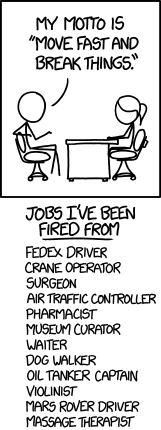

Working in a technical profession I am compelled to keep abreast of new tools and techniques; however the sheer volume of new languages, frameworks, libraries and associated best practice can make this compulsion exhausting!

Many people I've spoken to have expressed a desire to become experts in these tools before they feel comfortable using them. This article outlines why I feel it is not appropriate in many cases to become an expert and why the benefit of trying new things outweighs the lack of experience you may have.

In many ways I feel that the Facebook motto
> Move fast and break things (which has now been amended) [Facebook changes motto](http://mashable.com/2014/04/30/facebooks-new-mantra-move-fast-with-stability/)

Is similar to what I'm promoting here it's not universally applicable there are many safety or security cases where expert knowledge is neccessary [XKCD](https://xkcd.com/1428/) sums this up nicely

Anyway, excluding certain specific cases I feel the aspiration to become expert before using something can at best be paralysing or at worse invoke fear, leading to a reluctance to move away from known comfort areas.
This fear is normal, but unfounded; many years ago I took the conscious decision to opt for a breadth first learning approach. I had not heard the term at the time and it was more a desire to understand all the options before diving in but I have continued to focus on learning new things versus becoming expert in one.

> You can listen to an excellent talk from Don Norman describing depth
> and breadth first learning here
> [https://www.ted.com/talks/don_norman_on_design_and_emotion/](https://www.ted.com/talks/don_norman_on_design_and_emotion/)

## Why I've chosen breadth first over depth first learning

Many people assume you must be an expert in the technologies you use. Whilst my Pluralsight IQ tests might suggest otherwise I would not class myself an expert in any particular technology.

Respected industry guru's such as Jon Skeet (C#) are experts in their chosen technology and whilst I'm not suggesting they are only expert in one area, or are not highly capable in many others I feel that judging yourself against these standards is both inappropriate and counter productive.

The parallel I would draw here is judging yourself against the edited highlights you can view via social media such as facebook or twitter, personally, when viewing a facebook feed, I see `great holiday` > `romantic anniversary gesture` > `new baby` > `house purchase` > <insert major life event> over and over. I don't judge myself against the best part of hundreds of friends and associates in a social sense, so why should you do the same professionally?

I would go as far to suggest that following prominent tech representatives on something like twitter can of course by highly informative, but also depressing. You see all the great things people are doing, and all the highlights from experts in hundreds of tech areas, specialist projects and funded commercial ventures and feel like you're range of knowledge of inferior in all ways. Losing confidence in these areas by judging yourself against such standards is quite possible and totally counter productive.

I feel that the `expert` tag is a specific barrier to entry when people wish to learn a new skill. Many colleagues I've spoken to have been put off investigating an idea or asking a question because they feel it may make them look stupid to experts. Whilst not universally demonstrated I have certainly experienced arrogance from other developers who feel that certain aspects of their specialism should be common knowledge and aren't as helpful as they could be when less experienced users attempt to ask for assistence.

## A counter to being an expert

I would suggest developers should aim to be as non-expert as possible as often as possible.

There are many reasons for this but in particular I would emphasise that by opening yourself up to niavity, you open yourself up to learning and you open yourself to new ideas. By intentionally being non expert you are forced to asked questions to help you understand but more importantly you need to listen to those answers with an open mind. You will have fewer engrained opinions so as a non-expert so you will be less likely to ignore suggestions or shoot things down.

The technology industry moves so fast that it is literally not possible to become and expert in many if any area without it being at the expense of picking up new skills. You would be effectively putting your eggs in one basket and hope your chosen area / technology doesn't suddenly become defunkt overnight, which is a very real possibility. I'm not suggesting you don't try to learn what is neccessary to succeed in the project or toolset your currently using, but I am suggesting that spending too much time fixating on memorising the specific syntax or API of a particular language or library (at least up front) is redundant.
Being more aware of the general direction that the industry is heading and being able to recognise when something is becoming old hat is also a valuable skill for your career.

When you are open to trying new tools and technologies you allow yourself a mechanism to de-risk these things by experimentation. You can find ways to produce MVP's or proof of concepts with these tools and put yourself in the best position to critically analyse whether these are appropriate for your next large scale venture. You are also in a better position to leave a technology when you try more things as you will have less vested effort and aren't likely to be totally dependant on it.

Finally, the act of trying new technologies is fun! once you are able to get over any desire to be brilliant at something immediately you will find yourself less frustrated at not being able to complete simple tasks, more tolerant of new methods which you're not familiar with and inherently allow more time to find solutions to problems. All of the previous points are valuable day to day development qualities, re-read the previous sentence and ask yourself if those are things you'd want or not?

## No one is an expert anyway

Over the years I have worked with several very talented expert colleagues and have learnt a great deal from them. Over this time one thing has however become clear, whilst they may be expert in certain areas they are most certainly not in others.

More and more, developers are asked to cover a wider range of tasks ranging from dev ops, to design and user experience. Especially in smaller or medium sized organisations companies want multi-skilled developers able to fill multiple roles on multiple projects and expect the classic Full Stack Developer. It is commercially viable to be be adequate in many areas and a full expert in few.

At the end of the day, you will need to make a choice for yourself, do you you aspire to focus all your time an attention in one area? or do you want to master the key points of many?
Do you want to be a gardener who grows awesome tomato's but can't grow a lettuce for your salad?

Being an expert is valuable in many cases but it's not for everyone and the overall point I wish to stress is that you can make a pro-active choice not to be expert and be happy and successful with this decision.
