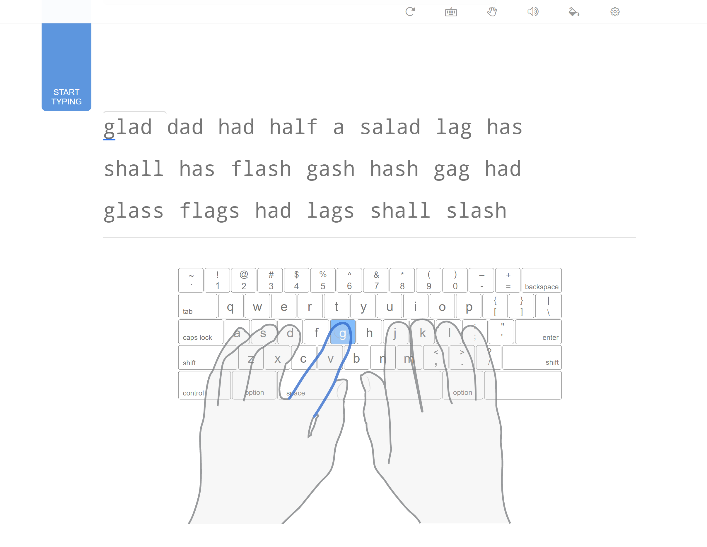

## Intro
As a developer it is assumed the you can output code as a reasonable speed, but how you get there is more or less up to you.
After spending several years bludgening my way through an ineffective typing technique I decided to learn to touch type properly and endure the
associated embarressment whilst learning!

## Why bother?

I can type keys at a reasonable speed to a reasonable level of accuracy so why should I care about being able to touch type properly?

Over the years, my typing has evolved (slightly) from two finger power tapping whilst diligently monitoring my fingers, to touch typing in a way that
allows me to view the screen only but often this involves significant keyboard gymnastics.

Having experienced many issues of repetitive strain injury over the years mainly from gaming, but also working I took the decision that poor keyboard technique may well
be to blame.

Taking this into account and in an effort to prolong my lifespan as a software developer I took the decision to learn to touch type, hoping that more effectively hand position
and less `finger keyboard miles`.

## How to learn to touch type?

Initially I wanted to find a suitable website or product which would help me write code rather than just touch-type. However two reasons stopped me from completing this goal, firstly, there seems precious little in terms of dedicated coding touch type sites. There are a few but often they seem just to ask you to type code and assume you know where you're fingers should go, I knew I would cheat at this and fall back into bad habits, so it wasn't going to work. Secondly, I realised that a large percentage of my development life is also spent writing stories, emails, slack messages and similar, meaning that the value from touch typing in any form was going to yield some benefit!

It turns out there are hundreds of resources online to learn to touch type. Historically the mother of all touch typing in the early 90's when I started using computers was the mighty Mavis Beacon! she has a free website which looks like it was written in the early 90's.

http://www.mavisbeaconfree.com/

Unfortunately I wanted to learn at lunchtime at work and we aren't allowed to simply download any old software, so I can across Typing Club - https://www.typingclub.com/
Whilst I think this may be geared up for schools it does have a nice interface showing which fingers to use, small segmented lessons and works online entirely.

## Learning to touch type code

At a high level Redux is a JavaScript library which you can use with React,
it is one of several solutions to help you manage application state on the client.

Redux attempts to make state mutations predictable by enforcing three core principles:

- State has a single source of truth
- State is read-only
- State changes happen with pure functions

## Slow progess

## Comfort

## Errors

## The future