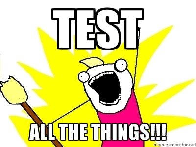

Recently I was working on a project with an immensely long multipart form (approximately 200 fields) and during this task our team established that it would be a huge time sink to need to manually regression test the form each time we made changes.

We had acceptable unit testing on the project at this point, just over 50% but had missed some UI bugs we felt we should have caught so automated UI testing was seen as a mechanism to catch those pesky UI bugs earlier in our process.



Having not seriously investigated automated UI testing I felt this was a chance to assess the tools and put in place a simple framework which our testers could build on.

The goals for the task were:

- Simplicity - ensure other devs and testers could understand the tests
- Automation - ensure the tests could be run as part of our nightly TFS build
- Error highlighting - ensure the test errors could be effectively reported

## Tools

The last time I attempted automated UI testing for .NET projects it wasn't a great experience. We used the Selenium webdriver with Chrome and Firefox and encountered issues getting our build servers to play nicely with the browsers. We also tended to have numerous complex tests as we were testing Ext.NET code which generated dynamic HTML ID's for many of the elements making them very brittle.

After a little googling, I can across this little beauty:


That ladies and gentlemen is a Coypu ... It's not quite what you think, I am of course referring to the  library which offers the following

> Coypu supports browser automation in .Net to help make tests readable, robust, fast to write and less tightly coupled to the UI
> If your tests are littered with sleeps, retries, complex XPath expressions and IDs dug out of the source with FireBug then Coypu might help.

This sounded promising, as the problems with complex XPath expressions and issues with timings had been problems we'd experienced in the past.

Additionally Coypu's DSL / API is simple and untuitive for devs and testers alike, which really appealed ignoring the setup and teardown of tests, and individual test for the happy case for one of our pages might look like this.

```csharp
[Test]
public void it_can_enter_the_full_name() {
  browser.Visit("/FullnameURL");

  browser.FillIn("Fullname").With("Test Fullname");
  browser.ClickButton("Save and continue");

  Assert.That(browser, Shows.Content("Some content we expect after clicking save"));
}
```

We really liked the simplicity of the `Visit`, `FillIn`, `With` and `ClickButton`, Coypu wraps up many of the problems we'd seen in the past with form completion like locating items without needing to interrogate the DOM too heavily and ensuring pages had loaded before verifying that items exist.

In the snippet above, the `FillIn()` function will match `input` elements on the page by label text, id, name (except radio buttons), placeholder or radio button value which means we didn't need to open the dev tools or IDE to find our element.
Similarly, `ClickButton()` is located by value/text, id or name making it quick and easy to find our controls.

Finally, one of the cleverer bits of Coypu that it handles the faff of waiting for requests to resolve before performing it's assertations. In the code above, the `Save and continue` button causes a full post-redirect-get cycle on the server, but Coypu doesn't care, it just handles the page refresh and allows us to `Assert` content on the next page.

## Setup

Setup with Coypu is simple and hassle free, simply install the nuget package and NUnit and you're (more or less) good to go.

In the past we had experienced issues with different browsers on the build server but fortunately Coypu plays happily with PhantomJS which was to be our test target so we've added that package too.

Finally if you want the snazzy NUnit matchers you need to install the `coypu.nunit` package too. The complete package install looks like this:

```csharp
PM> install-package nunit
PM> install-package coypu
PM> install-package Coypu.NUnit
PM> install-package phantomjs.exe
```

## Automation

I wanted the UI test to form part of the nightly build where we also run our SonarQube analysis. I also didn't want to slow down the CI build with the UI tests.

To do this the Coypu tests were added in their own project and the project excluded from the CI build within TFS. Our project was called `Project.UI.Tests` so the exclusion in TFS looked like this.

// TODO: Add image

## Error reporting

As well as running the tests automatically I wanted to report the output in an effective way so that in the event of failure the team could easily identify what the problem may have been.

The problem with both automated tests is that besides the failure message you don't get to see a lot of what happened.

The solution to this is another handy Coypu feature, the ability to take screenshots of the test when it's executing. You could set this up in many ways depending in your need, but for us we wanted to grab a screenshot any time a test failed.

Due to the number of tests I didn't want to write this out each time, so I wrote a base class which provides a `Teardown` method that checks the status of each test and captures a screenshot if the test failed with the date, time and test name for later identification.

```csharp
namespace Project.UI.Tests
{
  public abstract class TestBase
  {
    protected BrowserSession browser;

    [SetUp]
    public virtual void Setup()
    {
      browser = UiTestConfig.BrowserSession;
    }

    [TearDown]
    public void Teardown()
    {
      if (TestContext.CurrentContext.Result.Outcome.Status.Equals(TestStatus.Failed))
      {
        var screenshotName = $"TestFailure_{DateTime.Now:yyyy-MM-dd}
          _{DateTime.Now.Hour}_{DateTime.Now.Minute}_{DateTime.Now.Second}
          _{TestContext.CurrentContext.Test.FullName}";
        browser.SaveScreenshot($@"c:\temp\{screenshotName}.png", ImageFormat.Png);
      }
      browser.Dispose();
    }
  }
}
```

## Downsides

At the moment our build simply emails the team on failure, it would be great if we could package the images with the build failure but unfortunately I don't think TFS allows this level of customisation without digging quite deep so our test failures still involve some leg work to dig out the failure images and match them up.

The other issue which I believe is a general automated UI test problem is that you need something to test upon. At the moment we are running the tests against our test server which is deployed independently of the test run.
What this means is that unless we remember to deploy the test system daily, there could be new tests running on old code.

One solution to this may be to auto deploy to our internal testing server via the CI build, but at the moment we're preferring letting the testers choose when to deploy the code rather than having it constantly updated. This may change as we move forward with the automated tests or if we see false negatives in the test results.

Finally it seems like Coypu isn't that regularly worked upon, there are some outstanding pull requests from 2015-2016 and very few commit's lately. However, having said this it could be that the project is robust enough not to need much fixing and there may not be a desire to add to what is already a pretty solid DSL/API.

I have one feature I'd like it to offer, namely the ability to select radio buttons by position rather than needing specific names / ids so I may add this and see how it's received.

## Summary

It's been a great experience automated the UI testing on the project and via a combination of Coypu and Phantom a really painless experience.
For anyone who's used Selenium in the past and got bogged down in selector hell, timing issues and trying to locate transient elements such as modals and elements revealed by hover state, give it a go you won't regret it.


