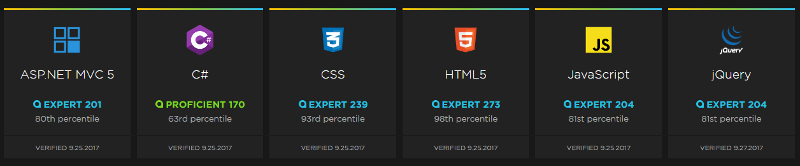

Working in a technical profession I am compelled to keep abreast of new tools and techniques; however the sheer volume of new languages, frameworks, libraries and associated best practice can make this compulsion exhausting!

Many people I've spoken to have expressed a desire to become experts before they feel comfortable using something new. This article outlines why I feel it is not appropriate in many cases to become an expert and why the benefit of trying new things outweighs the lack of experience you may have.

In many ways I feel that the Facebook motto is similar to what I'm promoting here.

>Move fast and break things

The motto has now been amended [Facebook changes motto](http://mashable.com/2014/04/30/facebooks-new-mantra-move-fast-with-stability/) as Facebook wanted to emphasise stablity in its products and as [XKCD](https://xkcd.com/1428/) summarises it's not always appropriate!

However, excluding certain specific cases I feel the aspiration to become expert before using something can be paralysing, creating a fear which can lead to a reluctance to move away from known comfort areas. This fear is normal, but generally unfounded.
Many years ago I took the conscious decision to opt for a breadth first learning approach, a term unfamiliar to me at the time.

> You can listen to an excellent talk from Don Norman describing depth and breadth first learning here
> [https://www.ted.com/talks/don_norman_on_design_and_emotion/](https://www.ted.com/talks/don_norman_on_design_and_emotion/)

Personally I encountered these approaches via a desire to understand as many options as possible before making a decision, but having found a term which matched what I considered a slapdash approach I continued to focus on learning new things versus becoming expert in one.

## Why I've chosen breadth first over depth first learning

Many people assume you must be an expert in the technologies you use. Whilst my Pluralsight IQ tests might suggest otherwise I would not class myself an expert in any particular technology.

Respected industry guru's such as Jon Skeet are experts in their chosen technology and whilst I'm not suggesting they are only expert in one area I feel that judging yourself against these standards is both inappropriate and counter productive.

The parallel I would draw here is judging yourself against the edited highlights from social media. I don't judge myself against the best part of hundreds of friends and associates in a social sense, so why should you do the same professionally?

I would go as far to suggest that following prominent tech representatives on something like twitter whilst informative, is largely depressing. You see all the great things people are doing, all the highlights from experts in hundreds of tech areas, specialist projects and funded commercial ventures and feel like your range of knowledge is inferior in all ways. Losing confidence in these areas by judging yourself against such standards is totally counter productive.

I feel that the `expert` tag is a specific barrier to entry when people wish to learn a new skill. Many colleagues I've spoken to have been put off investigating an idea or asking a question because they feel it may make them look stupid. Whilst not universally demonstrated I have certainly experienced arrogance from other people who feel that certain aspects of their specialism should be common knowledge (linux users I'm looking at you!) and aren't as helpful as they could be when less experienced users attempt to ask for assistence.

## Be a novice, it's good for you

I would suggest developers should aim to be as non-expert as possible as often as possible.

There are many reasons for this but in particular I would emphasise that by opening yourself up and showing your niavity, you open yourself up to learning and new ideas. By intentionally being non expert you are forced to asked questions to help you understand but more importantly you need to listen to those answers with an open mind. You will have fewer engrained opinions as a non-expert and less likely to ignore suggestions or shoot things down.

There is so much value to be had for putting yourself out there by trying new things, engaging in the open source community for example where you will meet some frankly miraculous people are often willing to devote their time to helping you get their tool up and running. Even stalwarts like Uncle Bob advocate [learning one new language a year](http://blog.cleancoder.com/uncle-bob/2016/09/01/TheLurn.html) and you wouldn't argue with Uncle Bob would you? (No really you shouldn't, I've heard him talk live and he's scary!)

The technology industry moves so fast that it is not possible to become and expert in everything and I feel each time your choose to become and expert it is at the expense of experiencing something else. You are effectively putting your eggs in one basket in the hope that the chosen technology doesn't become defunkt overnight, which is a very real possibility. I'm not suggesting you don't try to learn what is neccessary to succeed in the project or toolset your currently using, but I am suggesting that spending too much time fixating on memorising the specific elements of a language or library is largely redundant.
Being more aware of the general direction that the industry is heading and being able to recognise when something is becoming old hat is also a valuable skill for your career.

When you are open to trying new tools and technologies you allow yourself a mechanism to de-risk these things by experimentation. You can find ways to produce MVP's or proof of concepts with these tools and put yourself in the best position to critically analyse whether these are appropriate for your next large scale venture. You are also in a better position to leave a technology when you try more things as you will have less vested effort and aren't likely to be totally dependant on it.

Finally, the act of trying new technologies is fun! once you are able to get over any desire to be brilliant at something you will find yourself less frustrated at not being able to complete simple tasks, more tolerant of methods you're not familiar with and accepting of needing more time to find solutions to problems. All of the previous points are valuable day to day developer qualities, re-read the previous sentence and ask yourself if those are things you'd value or not?

## No one is an expert anyway

Over the years I have worked with several very talented colleagues and have learnt a great deal from them. Over this time one thing has however become clear, whilst they may be expert in certain areas they are certainly not in others.

More and more, developers are asked to cover a wider range of tasks ranging from dev ops, to design and user experience. Especially in smaller or medium sized organisations where companies want multi-skilled developers able to fill multiple roles or the `Full Stack Developer`. [This article](https://medium.com/coderbyte/a-guide-to-becoming-a-full-stack-developer-in-2017-5c3c08a1600c) by Daniel Borowski outlines my point very succinctly.

> Being a Full-Stack Developer doesn’t mean that you have necessarily mastered everything required to work with the front-end or back-end, but it means that you are able to work on both sides and understand what is going on when building an application

TLDR; It is commercially viable to be be proficient in many areas but an expert in few.

At the end of the day, you will need to make a choice for yourself, do you you aspire to focus all your time an attention in one area? or do you want to master the key points of many?
Do you want to be a gardener who grows awesome lettuce's but can't grow a tomato or cucumber? is this how you want your salad?

Being an expert is valuable in many cases but it's not for everyone and the overall point I wish to stress is that you can make a pro-active choice not to be expert and be happy and successful with this decision.
