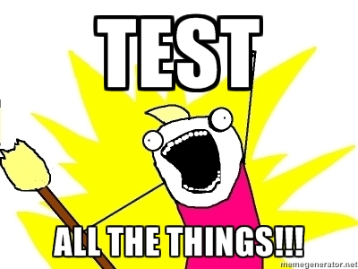
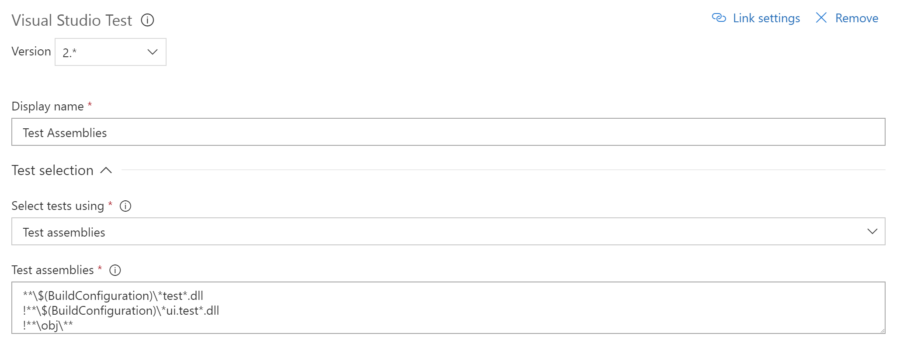

Recently I was working on a project with an immensely long multipart form (approximately 200 fields) and during this task our team established that it would be a huge time sink to need to manually regression test the form data entry each time we made changes.

We had acceptable unit testing on the project at this point, just over 50% and rising but had missed some UI bugs we felt we should have caught so automated UI testing was seen as a mechanism to catch those pesky UI bugs earlier in our process.



The last time I attempted automated UI testing for .NET projects it wasn't a great experience. We used the Selenium webdriver and encountered issues with needing to write complex tests with CSS or XPath selectors to find elements.
This wasn't helped by the fact we were using Ext.NET which generated complex HTML structures for it's controls and dynamic ID's unless specifically set.
This made the tests brittle as changes to the nesting levels of elements or someone forgetting to set ID's caused failures and required constant maintenance.

Having not seriously investigated automated UI testing for a while I felt this was a chance to assess the tools and put in place a simple framework which our testers could build on.

The goals for the task were:

- Simplicity - ensure other devs and testers could understand the tests
- Automation - ensure the tests could be run as part of our TFS builds
- Error highlighting - ensure the test errors could be effectively reported

## Tools

The core functionality of Selenium still seems to be the go-to place for automated UI testing in .NET apps but I wanted to avoid the issues we'd had historically with complexity. After a little googling, I can across this little beauty:


That ladies and gentlemen is a Coypu ... It's not quite what you think, I am actually referring to the [Coypu](https://github.com/featurist/coypu) testing library which claims:

> Coypu supports browser automation in .Net to help make tests readable, robust, fast to write and less tightly coupled to the UI
> If your tests are littered with sleeps, retries, complex XPath expressions and IDs dug out of the source with FireBug then Coypu might help. - **GitHub Readme.md**

This sounded promising as the problems with complex expressions and issues with timings had been problems we'd experienced in the past and being able to de-couple UI tests from the UI implementation seemed like an interesting idea.
Additionally Coypu's DSL / API is simple and untuitive for devs and testers alike, which really appealed.

I setup an individual test for the happy case of one of our pages and it looked like this.

```csharp
[Test]
public void it_can_enter_the_full_name() {
  browser.Visit("/FullnameURL");

  browser.FillIn("Fullname").With("Test Fullname");
  browser.ClickButton("Save and continue");

  Assert.That(browser, Shows.Content("Some content we expect after clicking save"));
}
```

We really liked the simplicity of the `Visit`, `FillIn`, `With` and `ClickButton`, Coypu wraps up many of the problems we'd seen in the past with form completion like locating items without needing to interrogate the DOM and ensuring pages had loaded before verifying that items exist.

In the snippet above, the `FillIn()` function will match `input` elements on the page by `label text`, `id`, `name`, `placeholder` or radio button value which means we didn't need to open the dev tools or IDE to find our element. Similarly, the button for `ClickButton()` is located by `value/text`, `id` or `name`.
The ability to locate items by button text and form labels is a massive win as it means testers can write selectors by viewing the UI rather than using browser dev tools and write tests using language the customer understands.

Coypu does allow you to use more complex CSS or XPath selectors if you want to, but it's generally not needed, which would you rather?

>`browser.FindCss(".menu.submenu", text: "Help")`

or

>`browser.ClickLink("Help")`

The former is how I remember writing raw Selenium tests and the latter is how I always wanted to. The former relies on the implementation of your menu, the latter doesn't.

Finally, one of the cleverer bits of Coypu that it handles the faff of waiting for requests to resolve before performing it's assertations. In the code above, the `Save and continue` button causes a full post-redirect-get cycle on the server, but Coypu doesn't care, it just handles the page refresh and allows us to `Assert` content on the next page.

## Automation

I wanted the UI test to form part of the nightly build where we also run our [SonarQube](https://www.sonarqube.org/) analysis. I also didn't want to slow down the CI build with the UI tests.

To do this the Coypu tests were added in their own project and the project excluded from the CI build within TFS. Our project was called `Project.UI.Tests` so the exclusion in TFS 2017 looked like this.



## Error reporting

As well as running the tests automatically I wanted to report the output in an effective way so that in the event of failure the team could easily identify the problem.
However the issue with automated tests is that besides the failure message you don't get to **see** a lot of what happened, you might get a stack trace but that's not very accessible for our testers.

The solution to this is another handy Coypu feature, the ability to take screenshots of the test when it's executing.
I didn't want to write this out each time, so I wrote a base class which provides a `Teardown` method that checks the status of each test and captures a screenshot if the test failed with the date, time and test name for later identification.

```csharp
namespace Project.UI.Tests
{
  public abstract class TestBase
  {
    protected BrowserSession browser;

    [SetUp]
    public virtual void Setup()
    {
      browser = UiTestConfig.BrowserSession;
    }

    [TearDown]
    public void Teardown()
    {
      if (TestContext.CurrentContext.Result.Outcome.Status.Equals(TestStatus.Failed))
      {
        var screenshotName = $"TestFailure_{DateTime.Now:yyyy-MM-dd}
          _{DateTime.Now.Hour}_{DateTime.Now.Minute}_{DateTime.Now.Second}
          _{TestContext.CurrentContext.Test.FullName}";
        browser.SaveScreenshot($@"c:\temp\{screenshotName}.png", ImageFormat.Png);
      }
      browser.Dispose();
    }
  }
}
```

## Downsides

At the moment a failing build emails the team, it would be great if we could package the images with the email unfortunately I don't think TFS allows this level of customisation so our test failures still involve some leg work to dig out the failure images and match them up.

The other issue with automated UI tests is that you need something to test against. At the moment we are running the tests against a server which is deployed independently of the test run.
This means is that unless we remember to deploy the test system daily, there could be new tests running on old code.

One solution to this is to auto deploy to via the CI build, but at the moment we're preferring letting the testers choose when to deploy the code rather than having it constantly updated. This may change as we move forward with the automated tests or if we see false negatives in the test results.

Finally it seems like Coypu isn't that regularly worked upon, there are some outstanding pull requests from 2015-2016 and very few commit's lately. I have one feature I'd like it to offer, namely the ability to select radio buttons by position rather than needing specific names / ids so I may add this and see how it's received.

## Summary

It's been a great experience automated the UI testing on the project and via a combination of Coypu and Phantom a really painless experience.
I hope to post more specific Coypu UI testing information touching on topics such as running the same test suite through multiple browsers and how we setup a simple framework to allows testers to write tests easily in the future.

For anyone who's used Selenium in the past and got bogged down in selector hell, timing issues and trying to locate transient elements such as modals and elements revealed by hover state, give it a go you won't regret it.


