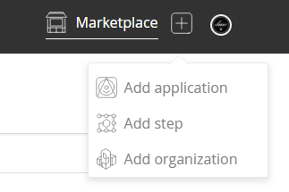

This post describes how you can test, build and deploy a JavaScript app which required external tooling to build (such as Ember, Gatsby or Create React App) to Azure websites as simply as possible.

Whilst the Azure documentation claims to be able to do this, every time I've tried many hours have been lost trying to debug kudu configs with zero success.

## The aspiration

- Create a Github webhook triggering a build and deploy on merged PR into master
- A remote build of the app so we don't need to do that locally on each change
- A remote deployment of the application to an Azure website

## Enter Wercker

[Wercker](http://www.wercker.com/) is a cloud hosted CI/CD tool which is currently free to use. Wercker uses a [yaml](http://yaml.org/) configuration file to define your pipelines and a concept of workflows to tie those pipelines together.
For example you might have a `test` and `deploy` pipeline which you want to execute when files are pushed to your repository.
You can also hook Wercker into GitHub so that pipelines are run a pre-cursor to allowing a pull request to be merged, commonly your test step.

### Creating a project

First, create an account on [Wercker](http://www.wercker.com), then create an application by clicking `add application` in the top right.



Next tell Wercker where the project lives, (Wercker currently integrates with GitHub, GitLab and Bitbucket). Once you've selected your source control provider, you can find your repository in the list and click through the remaining options. Finally you will see a review page which looks like this.


This project will act as the container for your workflows and a workflow is where you define the pipeline you want to run in response to an event in GitHub.

### Setting up a workflow

Next you need to setup a workflow, click on the `Workflow` tab in Wercker and you will probably see a default workflow and a pipeline below both called `build`. If you do, click on the build pipeline and rename it to something like `deploy`.

A workflow is a collection of one or more pipelines, and a pipeline is set of steps in a wercker.yml which describes a process you wish wercker to perform.

### Wercker.yml config

Now we can configure our app to tell it how to build and deploy our app. You do this by adding a `wercker.yml` file to the root of your repository and adding a series of steps which form a pipeline, let's look at the `wercker.yml` for this website.

```yaml
box: node
deploy:
  steps:
# build the site with gatsby
    - script:
      name: gatsby build
      code: |
        npm install -g gatsby-cli
        npm install
        gatsby build

# deploy to azure
    - wercker-labs/azure-ftp-deploy:
        cwd: public/
        publish-url: $publish_url
        username: $username
        password: $password
```

So what's going on here? wercker uses [Kubernetes](http://www.kubernetes.com) under the hood to containerise your build but we don't need to worry the details, we start by telling wercker what `box` to use. In our case it's a box which contains `node`.

#### Build the site

We can then see a the pipeline step we called `deploy`.

> NOTE: The step here must match the name you gave your pipeline in Wercker.

Next we have two `steps` denoted by a minus `-` and the indentation level.
The first is a `script` step with three commands called `gatsby build`. It first installs the `gatsby-cli` (this could equally be `create-react-app`, `ember-cli` or similar) which is the tooling you need to actually build your site.

We then run a simple `npm install` to add our dependencies and finally `gatsby build` to produce our build output. Note how similar this is to how you might build your site locally, ensuring the context switch from your local machine to your build environment is minimal.

#### Deploy to Azure

Our second step, is from the [Wercker Step Registry](https://app.wercker.com/explore/steps/search/) where you can find many pre-written steps available for free. It's called `wercker-labs/azure-ftp-deploy` and as you might guess from the name, we use to deploy to Azure via FTP. The `cwd` parameter tells the step where to find the content we want to transfer to Azure which in the case of `gatsby` is the `public` folder, this might be your `build` or `dist` folder depding on what your using.
The other three parameters are the FTP publish url, username and password to use for the transfer.

> You can get these values from the publish profile in Azure either [via powershell](https://msdn.microsoft.com/en-us/library/dn414650(v=nav.90).aspx) or by logging into the Portal selecting your app service and finding the link at the top.

> Note: If your username is `awesomeapp\$awesomeapp` Azure will allow `awesomeapp` as the username, to avoid Wercker issues with the special characters.


### Secrets

You'll notice in the `wercker-labs/azure-ftp-deploy` step we don't provide any real values. The reason for this is that we want the `wercker.yml` to sit in source control and this in the case of GitHub would be publicly accessible.
Instead of the real values, we can use `environment variables` which are denoted by the `$` prefix and we can then use `Wercker` to provide these when it executes the workflow at build time.

You can add secrets in Wercker by going to the `Environment` tab and adding the three keys `publish_url`, `username` and `password` as shown below.


You can select `protected` for your sensitive informaton so that no one can see the values through the UI which I would recommend for almost all values. Out of paranoia I scrubbed out the FTP publish URL, you never can be too careful!

## Triggering a build

Last off, push something to you master branch (ideally via a PR as it's a protected branch right?) and you should then see Wercker spin up and begin executing the steps we defined which will give your output like this.


It's pretty good at reporting debugging info, so if you hit any snags it should be fairly straightforward to see what happened.

## Summary

The simplicity with which you can setup this process (literally 11 lines of .yaml) compared to [this equivalent kudu script](https://github.com/premchandrasingh/kuduscript/blob/master/asp.net/deploy.cmd) the automatic hook into Github and the clear effective UI within Wercker make this deployment method straightforward but also versitle. With very limited changes I have successfully used Wercker to deploy `ember`, `gatsby` and `create react app` to Azure without any problems but changing as little as a couple of npm commands in the config.

I would recommend you try this method if you are spending any of your time messing with Kudu scripts or trying to extract the logs from Azure scm to find out what went wrong!

